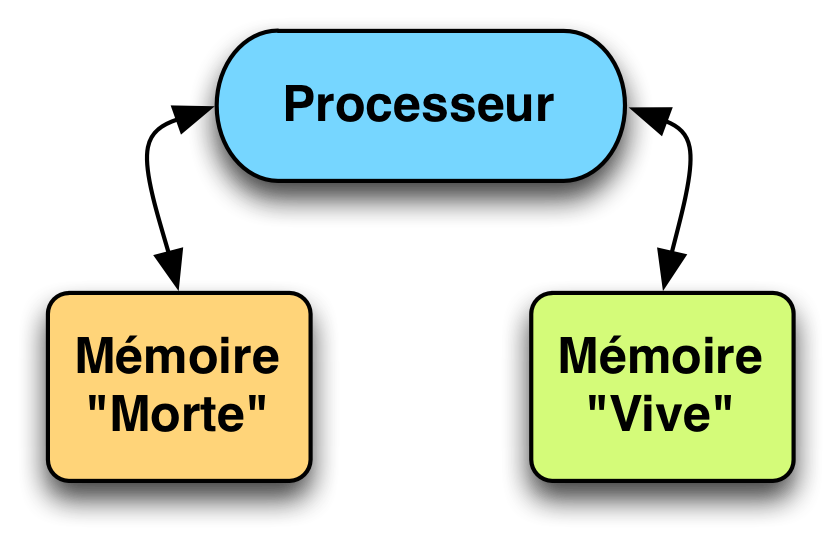
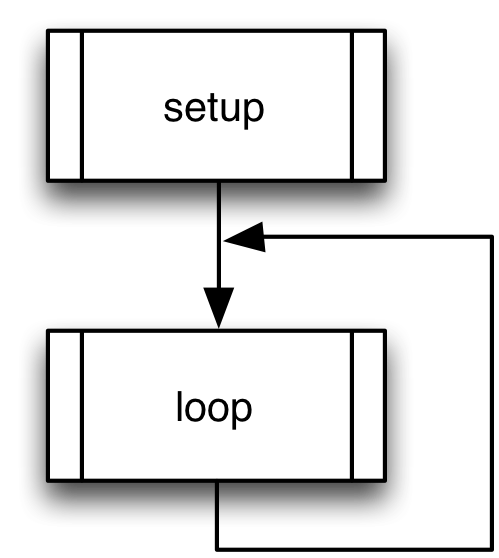

= Algorithmique - 01
Nicolas Ledez
:backend: deckjs
:deckjs_theme: web-2.0
:deckjs_transition: fade
:status:
:split:
:blank:
:goto:
:menu:
:toc:

== Définition

http://fr.wikipedia.org/wiki/Algorithmique

est l’ensemble des règles et des techniques qui sont impliquées dans la définition et la conception d'algorithmes, c'est-à-dire de processus systématiques de résolution d'un problème permettant de décrire les étapes vers le résultat.

<<<

En d'autres termes, un algorithme est une suite finie et non-ambiguë d’instructions permettant de donner la réponse à un problème.

== Exemple

image::images/algo-01.png[title="Exemple"]

== Ça tourne où

== Structures de données

[incremental="true"]
* constantes
* variables
* tableaux
* structures récursives (listes, arbres, graphes)

== Structures de contrôle

[incremental="true"]
* séquences
* conditionnelles
* boucles

== Arduino - base

[source,c]
[subs="verbatim,macros"]
----
void setup() {
}

void loop() {
  digitalWrite(13, HIGH);
  delay(1000);
  digitalWrite(13, LOW);
  delay(1000);
}
----

== Arduino - constantes

[source,c]
[subs="verbatim,macros"]
----
const int ledPin = 13;
#define combienAttendre 1000

void loop() {
  digitalWrite(ledPin, HIGH);
  delay(combienAttendre);
  digitalWrite(ledPin, LOW);
  delay(combienAttendre);
}
----

== Arduino - variables

[source,c]
[subs="verbatim,macros"]
----
int ledPin = 1;

void loop() {
  digitalWrite(ledPin, HIGH);
  ledPin++;
  digitalWrite(ledPin, HIGH);
  ledPin = ledPin + 1;
  digitalWrite(ledPin, HIGH);
}
----

== Arduino - tableaux

[source,c]
[subs="verbatim,macros"]
----
int myPins[] = {2, 4, 8, 3, 6};
int ledPin = 0;

void loop() {
  digitalWrite(myPins[ledPin], HIGH);
  ledPin++;
  digitalWrite(myPins[ledPin], HIGH);
}
----

== Arduino - conditionnelles - if

[source,c]
[subs="verbatim,macros"]
----
int i = 1;

void loop() {
  i++;
  if (i % 2) {
    digitalWrite(i, HIGH);
  }
  if (i > 13) {
    i = 1;
  }
}
----

== Arduino - conditionnelles - if/else

[source,c]
[subs="verbatim,macros"]
----
int i = 1;

void loop() {
  i++;
  if (i % 2) {
    digitalWrite(i, HIGH);
  } else {
    digitalWrite(i, LOW);
  }
  if (i > 13) {
    i = 1;
  }
}
----

== Arduino - boucles - for

[source,c]
[subs="verbatim,macros"]
----
void loop() {
  for (int i=1; i <= 13; i++){
    digitalWrite(i, HIGH);
  }
  for (int i=13; i >= 1; i--){
    digitalWrite(i, LOW);
  }
}
----

== Arduino - boucles - while

[source,c]
[subs="verbatim,macros"]
----
void loop() {
  i = 0;
  while(i <= 13){
    digitalWrite(i, LOW);
    i++;
  }
}
----

== Arduino - boucles - do - while

[source,c]
[subs="verbatim,macros"]
----
void loop() {
  int i = 0;
  while(i <= 13){
    digitalWrite(i, LOW);
    i++;
  }
}
----

== Arduino  - fonctions

[source,c]
[subs="verbatim,macros"]
----
void loop() {
  int i = 0;
  while(i <= 13){
    i = allume(i);
  }
}

int allume(int x) {
  digitalWrite(x, HIGH);
  return x + 1;
}
----

== Arduino - include

allume.h
[source,c]
[subs="verbatim,macros"]
----
int allume(int x);
----

allume.c
[source,c]
[subs="verbatim,macros"]
----
int allume(int x) {
  digitalWrite(x, HIGH);
  return x + 1;
}
----

programme.c
[source,c]
[subs="verbatim,macros"]
----
include <feux/allume.h>

void loop() {
  int i = 0;
  while(i <= 13) {
    i = allume(i);
  }
}
----

== Microcontroleur

== OS

image::images/algo-os.png[title="OS"]

== Paradigmes

== Procédural

[source,ruby]
[subs="verbatim,macros"]
----
def f1(x, y) do
    return x * y
end

def f2(x, y) do
    return x + y
end

f1(1, 2)
f2(3, 4)
----

== Objet

----
class MesNombres
    def initialize(x, y)
        @x = x
        @y = y
    end

    def f1 do
        return @x * @y
    end

    def f2 do
        return @x + @y
    end
end

n = MesNombres.new(1, 2)
n.f1
n.f2
----

== Portée des variables

== Portée - Globale

[source,c]
[subs="verbatim,macros"]
----
i = 0;

void loop() {
  while(i <= 13){
    digitalWrite(i, LOW);
    i++;
  }
}
----

== Portée - Locale

[source,c]
[subs="verbatim,macros"]
----
void loop() {
  i = 0;
  while(i <= 13){
    digitalWrite(i, LOW);
    i++;
  }
}
----

== Compilation ?

* Compilé
* Interprété
* Bytecode

== Merci

@nledez